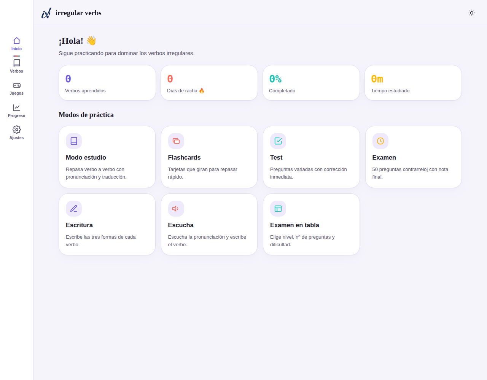
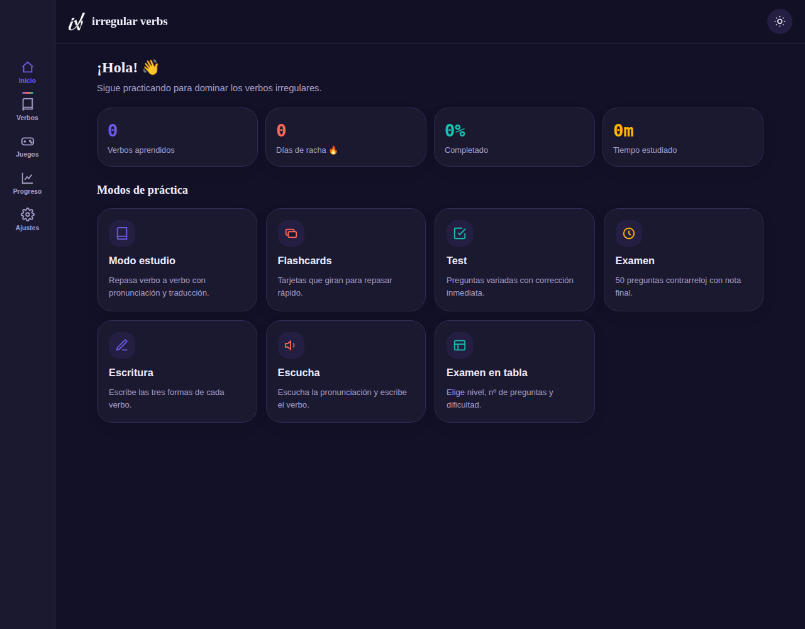
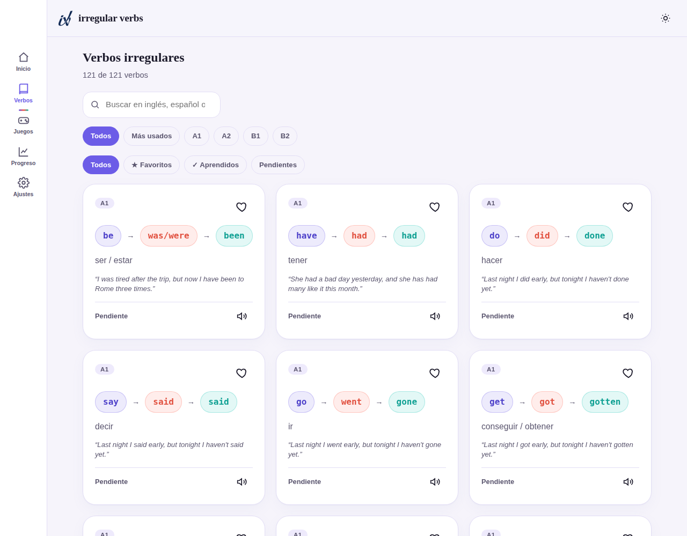
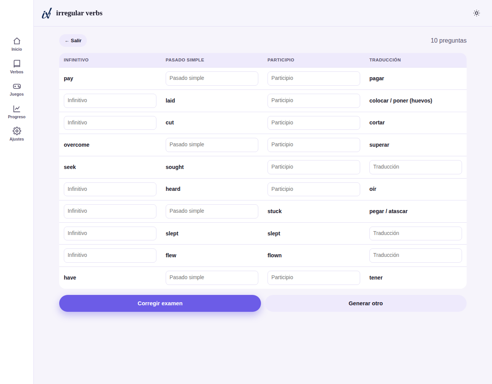

# 📘 IrregularVerbs

**La forma más divertida de dominar los verbos irregulares en inglés.**
Una web app 100% gratuita, instalable y que funciona sin conexión — construida solo con HTML5, CSS3 y JavaScript Vanilla (ES6+). Sin frameworks, sin build step, sin dependencias externas: abre `index.html` y ya está.

 

## 📸 Capturas

| Biblioteca (3 columnas) | Examen en tabla | Pantalla de inicio |
|---|---|---|
|  |  |  |

## ✨ Características

### Base de datos completa
121 verbos irregulares (de uso esencial a avanzado), cada uno con:
infinitivo, pasado simple, participio pasado, IPA de las tres formas, traducción, nivel CEFR (A1–B2), categoría semántica, ejemplo bilingüe, error frecuente y verbos relacionados.

### Identidad de marca
Logo e icono propios (badge navy `#0D2652` con la marca "iv"), favicon e iconos de instalación a juego, y una cabecera de bienvenida con el lockup tipográfico "irregular verbs" en serif — el icono de la barra superior se invierte automáticamente a blanco en modo oscuro para mantener el contraste.

### Biblioteca y búsqueda
- Buscador instantáneo por inglés, español o cualquier forma verbal.
- Filtros por nivel CEFR, "más usados", favoritos, aprendidos y pendientes.
- Tarjetas grandes en cuadrícula de 3 columnas con ejemplo incluido.
- Pronunciación independiente de cada forma del verbo (infinitivo, pasado y participio son clicables) además del botón de audio de la tarjeta.
- Ficha de detalle por verbo con pronunciación integrada.

### Modos de práctica
Todos los modos (Estudio, Flashcards, Test, Escritura, Escucha, Examen, Examen en tabla y Juegos) permiten elegir entre **por nivel CEFR** (A1–B2) o **Personalizado**: un buscador para marcar a mano el conjunto exacto de verbos que se quiere practicar — pensado para el ritmo real de clase, donde se aprenden de 5 en 5 y luego se repasan en conjunto de cara al examen. La selección personalizada es única y persistente: se elige una vez y queda disponible en todos los modos hasta que se cambie. Los modos que necesitan volumen (como el Examen, con 25-50 preguntas) exigen un mínimo de 5 verbos distintos en la selección; el resto de modos y los minijuegos se adaptan automáticamente al tamaño de la selección, por pequeña que sea.

- **Estudio** — repaso libre verbo a verbo, pronunciación (`SpeechSynthesis`) de cada forma, traducción ocultable y aviso de error frecuente.
- **Flashcards** — tarjeta 3D que gira al tocarla (infinitivo → resto de la información).
- **Test** — configurable por número de preguntas (10/20/30); 5 tipos de preguntas (opción múltiple, escribe el pasado, escribe el participio, escribe la traducción, mezcla), corrección inmediata, y al terminar una pantalla de resultado con revisión completa en verde/rojo. En las preguntas de opción múltiple se puede responder con el teclado (1-4).
- **Examen** — 50 preguntas cronometradas, nota final y revisión completa (verde/rojo) de cada pregunta; también admite responder con las teclas 1-4. Incluye historial de exámenes anteriores para repasarlos cuando quieras.
- **Examen en tabla** — configurable por número de preguntas (5/10/15/20) y dificultad (fácil = 1 hueco por fila, medio = 2, difícil = 3); genera una tabla de 4 columnas (infinitivo, pasado, participio, traducción) con huecos aleatorios; al corregir muestra la respuesta correcta bajo cada fallo, con comparación tolerante a espacios y mayúsculas/minúsculas.
- **Escritura** — el usuario escribe las tres formas del verbo y la corrección indica exactamente cuál ha fallado.
- **Escucha** — reproduce el audio de una de las tres formas del verbo (infinitivo, pasado o participio, al azar) y el usuario transcribe lo que oye.
- **Solo mis errores** — desde Progreso, repasa exclusivamente los verbos fallados en cualquiera de los modos anteriores.

### Minijuegos
Memory (emparejar verbo/traducción), Ahorcado, Ordenar letras y Completar huecos (banco propio de **500 frases contextuales bilingües**, con el hueco integrado en la propia frase) y Ruleta (gira y responde) — todos generados dinámicamente a partir de la misma base de datos, con el mismo selector de nivel/personalizado común a todos ellos. Ahorcado y Ordenar letras se pueden jugar también con el teclado físico.

### Progreso y motivación
- Favoritos, verbos aprendidos, racha diaria, precisión global y precisión del día — todo guardado automáticamente en `localStorage`.
- Gráficas dibujadas a mano en `<canvas>` (sin librerías): dona de progreso, actividad semanal, aprendidos por nivel.
- Panel de errores más repetidos, con un modo **"Solo mis errores"** para repasarlos exclusivamente en Estudio, Flashcards, Test, Escritura, Escucha o Examen.
- Sistema de logros tipo videojuego (55 logros en 9 categorías: primeros pasos, progreso, verbos aprendidos, constancia, precisión, por modos, dificultad, especiales y "los grandes"), con logros secretos ocultos hasta desbloquearlos y celebración animada.

### Configuración y accesibilidad
- Modo claro / oscuro / automático (según el sistema).
- Activar o desactivar sonidos y animaciones (respeta también `prefers-reduced-motion`).
- Exportar/importar el progreso como `.json`, y resetear todo con confirmación.
- Navegable 100% por teclado: `aria-label`s en controles interactivos, contraste AA, foco visible, respuestas de opción múltiple con las teclas 1-4, y Ahorcado/Ordenar letras jugables por completo con el teclado físico.

### PWA
Instalable en móvil y escritorio, con manifest y Service Worker (estrategia cache-first + stale-while-revalidate) para funcionar completamente sin conexión tras la primera visita.

## 🏗️ Arquitectura

```
irregularverbs/
├── index.html            # Estructura y todas las vistas (SPA por secciones)
├── manifest.json          # Configuración PWA
├── sw.js                  # Service Worker (offline-first)
├── robots.txt / sitemap.xml
├── css/
│   └── styles.css         # Sistema de diseño: tokens, componentes, temas, responsive
├── js/
│   ├── verbs.js            # Base de datos de verbos (fuente única de la verdad)
│   ├── gapSentences.js     # Banco de 500 frases contextuales para "Completar huecos"
│   ├── storage.js          # Capa de persistencia sobre localStorage
│   ├── core.js             # Utils, filtros/búsqueda y motor de logros
│   ├── ui.js                # Router de vistas, toasts, modal, render de tarjetas, voz
│   ├── stats.js            # Gráficas en <canvas> sin librerías
│   ├── quiz.js              # Estudio, Flashcards, Test, Examen, Escritura, Escucha
│   ├── games.js             # Memory, Ahorcado, Ordenar letras, Completar huecos
│   └── app.js                # Controlador principal: wiring, routing, init
├── icons/                  # Iconos e imagen de marca (favicon, PWA, badge, logo)
├── favicon.ico              # Favicon multi-resolución para navegadores
└── docs/screenshots/        # Capturas para este README
```

Cada módulo se adjunta a un único espacio de nombres global `App` (`App.Storage`, `App.UI`, `App.Quiz`…) para evitar colisiones y mantener el código desacoplado sin necesidad de un bundler. Todos los scripts se cargan como `<script>` clásicos (no ES modules) precisamente para que la app funcione al abrir `index.html` directamente con `file://`, donde los módulos ES tienen restricciones de CORS en varios navegadores.

## 🚀 Instalación

No requiere instalación de dependencias.

```bash
git clone https://github.com/TU-USUARIO/TU-REPOSITORIO.git
cd TU-REPOSITORIO
```

Después simplemente abre `index.html` en tu navegador, o sirve la carpeta con cualquier servidor estático para poder probar la PWA con Service Worker (los SW requieren `http(s)://`, no `file://`):

```bash
python3 -m http.server 8080
# abre http://localhost:8080
```

## 🌐 Despliegue en GitHub Pages

1. Sube este repositorio a GitHub.
2. Ve a **Settings → Pages**.
3. En "Source", selecciona la rama `main` y la carpeta `/ (root)`.
4. Guarda: GitHub Pages publicará la web en `https://TU-USUARIO.github.io/TU-REPOSITORIO/`.
5. Actualiza esa URL en `robots.txt`, `sitemap.xml` y las etiquetas Open Graph de `index.html`.

No hace falta build ni configuración adicional: es HTML/CSS/JS estático.

## 🛠️ Tecnologías

- HTML5 semántico
- CSS3 (custom properties, `color-mix`, Grid/Flexbox, animaciones)
- JavaScript Vanilla ES6+ (sin frameworks ni librerías)
- Web APIs: `localStorage`, `SpeechSynthesis`, `Canvas 2D`, `Service Worker`, `Web App Manifest`

## 📄 Licencia

Autoría de **goizanetdev**. Licencia personalizada: uso, modificación y
distribución libres para fines no comerciales, con atribución obligatoria.
Queda prohibida la venta, monetización o eliminación de la autoría sin
permiso explícito y por escrito. Ver [LICENSE.md](LICENSE.md) para el texto
completo (español/inglés).

## 🗺️ Roadmap

- [ ] Sistema de niveles/XP sobre los logros actuales.
- [ ] Soporte multi-idioma de la interfaz (actualmente en español).
- [ ] Sincronización opcional en la nube (hoy el progreso vive solo en el dispositivo).
- [ ] Modo "Ordenar verbos" (secuenciar una lista de verbos según un criterio).

---

Hecho con foco en que aprender los verbos irregulares deje de ser una lista aburrida que memorizar, y se convierta en algo que se juega. 🎮
